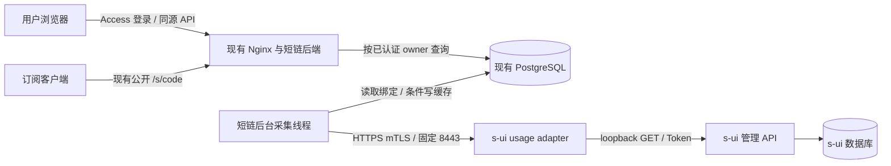

# 短链门户个人用量与有效期设计

日期：2026-09-09。状态：v1 已实现；部署与验收记录见 [运维说明](short-link-usage-operations.md)。

用户已确认采用“扩展现有短链门户”的方向，并确认每位门户用户有独立的 s-ui Client/节点凭据，随后授权实施。本文保留原设计和设计阶段的时间点证据；实际文件、测试命令与部署状态以运维说明为准。

## 1. 目标与范围

在现有登录页面中，用户可以看到自己的上传、下载、已用流量、总额度、剩余额度、账户有效期及状态。管理员可以把门户账号绑定到正确的 s-ui Client。查询失败不影响生成、下载和管理短链。

第一期包括：

- 复用现有 Cloudflare Access / API Key 身份和用户管理。
- 管理员预览、建立、命名和撤销账号绑定。
- 展示当前计数、额度、有效期、s-ui 启用状态、重置计划和数据查询时间。
- 启用、禁用、过期、超额、无限额、未绑定、待采集、数据过时、绑定失效等状态。
- 受保护的只读适配服务、后台采集、持久化最近一次统计、限流和审计。

第二期候选：个人历史流量曲线、历史查询的改名隔离、多 s-ui 实例的批量运营工具。

不在本期范围：购买套餐、支付、自动续费、修改 s-ui 额度、自动创建节点、逐用户逐节点计费、共享额度结算、重写短链转换器。用户用量与短链创建数量配额是两个概念。

## 2. 已验证基础与证据边界

### 2.1 本地代码与已有行为

| 事实 | 源码依据 |
| --- | --- |
| 门户身份是 `shortlink_users.external_subject`，短链以 `owner_subject` 归属 | [001_initial.sql](../db/migrations/001_initial.sql)、[shortlink_api.cpp](../src/handler/shortlink_api.cpp) |
| 管理员全局 Token 产生主体 `admin`；Access 当前使用邮件字符串；API Key 返回数据库中的 owner | `shortlink_api.cpp:159` 的 `authenticate_request` |
| 短链保存配置与响应头快照，只有显式刷新才重新转换 | `shortlink_api.cpp:537`、`:801` |
| PostgreSQL schema 实际由 C++ `ensure_schema()` 初始化，SQL 文件不会被 Compose 自动执行 | [postgres_store.cpp](../src/storage/postgres_store.cpp)、[Compose](../docker-compose.shortlink.yml) |
| 通用下载器允许重定向，并关闭 TLS peer/host 验证 | [webget.cpp](../src/handler/webget.cpp)，约 147 至 150 行 |
| s-ui `Client` 包含计数、额度、有效期、延迟启动和重置字段 | [model.go](../../s-ui/database/model/model.go) |
| 订阅 `HEAD` 只查询 `enable=true` 的 Client | [subHandler.go](../../s-ui/sub/subHandler.go)、[subService.go](../../s-ui/sub/subService.go) |
| 管理 API 的 Client 详情可查询禁用记录 | [apiService.go](../../s-ui/api/apiService.go)、[client.go](../../s-ui/service/client.go) |

设计基线：subconverter 与本地 s-ui 源码的快照提交（本文不记录具体 hash 与生产版本指纹）。本地源码与生产版本号并不证明二进制逐字节一致，实施前需用真实 API 合约检查。

### 2.2 生产只读快照结论（已去标识）

> 具体主机地址、版本指纹和账号数量属于部署环境信息，不随本文档发布；此处只保留结论。

- 短链与 s-ui 分处两台主机：短链以 Docker 运行，s-ui 由 systemd 运行。
- 生产 Client 数量有限，启用与停用并存，且存在未设置到期、延迟启动或自动重置的记录。
- s-ui 本机有效订阅 `HEAD` 返回 200，含 `upload/download/total/expire`；禁用 Client 返回 400。
- 配置中的历史保留期为 30 天，统计桶为 60 秒。未检查现有历史数据完整性。

以上是上一轮只读查询的结论，本轮没有重新访问生产。尚未验证管理 Token 的真实详情响应、跨服务器 mTLS 链路、性能或页面效果。旧短链方案文档中的部署状态有历史措辞，不能代替这份结论或上线前检查。

## 3. 核心决策

| 决策 | 理由 |
| --- | --- |
| 用量绑定门户账号，独立于短链 | 一个人可能拥有多条短链，不能重复计算同一个 Client 的额度 |
| 绑定由管理员维护，普通用户只读 | 用户不能通过改 Client ID 查看他人的统计 |
| s-ui 旁边运行小型 Go 适配服务 | 管理 Token 留在 s-ui 服务器；复用已有 API，无需先修改 s-ui 核心 |
| 适配服务按 ID 查询 Client 详情 | 能覆盖禁用账户和重置字段，避免订阅 HEAD 与列表投影的缺失 |
| 跨服务器采用 mTLS，固定目标和方法 | 不借用订阅抓取器的 TLS、代理、重试及缓存设置 |
| 短链后端每 30 秒采集，网页读取 PostgreSQL 缓存 | 浏览器并发不会放大 s-ui 请求，重启后可保留最近统计 |
| 本期只展示统计，不新增节点访问限制 | s-ui 继续负责额度和有效期执行；统计故障不撤销短链 |
| 保持现有账号字符串、旧表与快照语义 | 避免用量功能引入账号迁移和既有短链所有权变化 |

不采用用户自行填写管理 Token，不让浏览器直连 s-ui，不通过解析已有订阅链接推断账号归属。也不把 s-ui 数据库文件挂载到新服务：它会绕过 API 边界并耦合数据库结构。

## 4. 组件与信任边界



### 4.1 短链服务器

- C++ 负责门户授权、绑定、采集调度、缓存、标准响应和管理员审计。
- 使用已有 libcurl 和 RapidJSON，实现独立的严格 HTTP 客户端，不复用 `webGet` 的安全默认值。
- Provider 由只读配置文件定义；Web API 不接受 URL、代理地址、Token 或证书路径。
- PostgreSQL 只增加用量专属表，不更改 `short_links` / `short_link_versions`。
- 浏览器只请求 `/api/usage` 和管理员绑定接口，不接收 s-ui Client 名称、节点配置或管理凭据。

### 4.2 s-ui 服务器

- 新 Go 服务只使用标准库 `net/http`、`crypto/tls`、`encoding/json` 等；独立构建，不加入 C++ 构建依赖。
- 以非 root systemd 用户运行，使用 8443 等非特权端口；不占用现有 443、2095、2096。
- 本机上游地址从受保护配置读取，例如 `http://127.0.0.1:2095/<webPath>/apiv2/`；实际路径在实施时确认。
- 只允许向该上游执行 `GET clients?id=...`；不提供任意路径代理、管理写操作或数据库下载。
- 上游完整 Client 详情可能包含节点凭据，只允许短暂进入适配器内存，白名单归一化后丢弃；不记录原始响应。
- 无业务数据库、无持久化用量缓存。持久状态仅包括配置、证书、Token、身份指纹密钥和实例 epoch。

适配服务不是 s-ui 原生的最小权限 Token。它自身持有管理权限较大的 Token，因此服务账号、主机和配置文件仍属于受信任边界；泄露影响需通过撤销该 Token 处置。

## 5. 账号绑定与身份生命周期

### 5.1 标识

- `owner_subject`：直接采用现有认证函数返回的字符串。不得自行转小写、加前缀、用前端 email 覆盖或重命名 `admin`。
- `provider_id`：运维定义的稳定短名，例如 `sui-primary`，不是 URL。
- `instance_id`：部署适配器时生成的 UUID，代表这个 s-ui 数据集的 epoch，写入受保护配置。
- `client_id`：s-ui 的整数主键，以十进制字符串在 JSON 中传输。
- `identity_fingerprint`：适配器对 `[instance_id, client_id, createdAt, name]` 的规范 JSON 数组计算 HMAC-SHA256。密钥独立于管理 Token；`name` 只参与服务端指纹，不传给门户。

Client 名称也是订阅标识，不适合作为公开用户名。单靠数值 ID 不足以应对删除重建或数据库恢复，指纹用于检测常见身份变化；它不是上游提供的不可变用户 UUID。

### 5.2 绑定约束

- 每个活跃 `(provider_id, instance_id, client_id)` 只能属于一个门户 owner，数据库唯一索引保证并发正确性。
- 一名用户允许最多 10 个活跃绑定，当前通常只有一个；多个绑定分别展示，不生成混合“套餐总额/到期日”。
- 相同 Client 不能因多条短链重复绑定。绑定与 `short_link_id` 无关联。
- 禁用或超额 Client 也可以绑定和查询，因为用户需要了解失效状态。
- Label 是管理员输入的显示名，最多 80 个 Unicode 字符；不得自动使用 Client name、desc、links 或 config。
- 全局 bootstrap Token 可以操作管理接口，但 `/api/usage` 只查询它自身的 `admin` 主体，不自动返回全部用户数据。
- API Key 沿用当前权限语义；不借本功能把普通 API Key 提升为管理员。Access 管理员与全局管理 Token 按现有规则识别。

共享认证入口返回 `{owner, is_admin, auth_kind}`，其中 auth_kind 区分 `bootstrap_token`、`api_key`、`access_header`、`dev_user`，用于新接口的 Origin 策略。现有接口可继续使用兼容包装；认证优先级、用户创建和权限判断保持一致，不能在 usage 模块复制另一份逻辑。

### 5.3 操作流程

1. 管理员从已有门户用户列表选择 owner，通过 s-ui 管理资料或服务器上的受控只读查询核对 Client 数值 ID；尚未假定现有 s-ui 页面一定直接显示 ID。
2. 输入 Provider、Client ID 和显示名，执行“校验绑定”。后台查询真实详情，返回归一化预览、实例 ID 和身份指纹，不返回 Client name。
3. 管理员核对预览后保存。服务端再次查询并核对 `expected_instance_id`、`expected_identity_fingerprint`；变化则返回 409，要求重新预览。
4. 事务写入绑定与审计；后台线程立即被唤醒采集。新绑定初始状态为 `pending`。
5. 改显示名需要版本校验。更换 Client、owner 或 Provider 必须撤销旧绑定并重新预览建立，不直接修改身份字段。

### 5.4 改名、删除、恢复

- 改名、`createdAt` 变化或实例 epoch 不匹配：立即使该绑定的统计失效，显示“绑定信息已变化”，管理员重新核对。
- 成功的详情查询明确缺少目标 ID：标记 `client_missing`，清除可展示快照；不把网络失败当作删除。
- 解绑：同一数据库事务撤销绑定、删除缓存并记审计。之后发起的读取不再包含它；已有页面在下一次刷新移除。
- 采集完成前若发生解绑或重绑，条件写入必须失败，不能让旧采集结果恢复已撤销的数据。
- s-ui 数据库替换、恢复到不同身份集合、导入他人数据时，运维必须轮换 `instance_id`，暂停采集并重新确认绑定。原样备份恢复也需检查绑定。
- `createdAt=0` 的旧 Client 允许人工核对后绑定，但必须遵守 epoch 流程。上游未提供强身份保证，同 ID/名称/时间的重新创建可能无法自动区分；若未来要求自动保证，需在 s-ui 增加不可变 UUID，单独设计。
- HMAC 身份密钥轮换会使指纹失效，按重绑维护操作处理；管理 Token 和 TLS 证书轮换不应改变指纹。

## 6. 统计口径与字段

### 6.1 统一数据规则

| 字段 | 来源或算法 | 空值语义 |
| --- | --- | --- |
| `upload_bytes` / `download_bytes` | s-ui `up` / `down` | 未成功采集时整个 metrics 为 null |
| `used_bytes` | `up + down` | 不可用不能显示 0 |
| `limit_bytes` | `volume > 0` 时为 volume | null 表示无限流量 |
| `remaining_bytes` | 有限额时 `max(volume - used, 0)` | 无限额时 null |
| `over_limit_bytes` | 有限额时 `max(used - volume, 0)` | 无限额时为字符串 `"0"` |
| `expires_at` | `expiry > 0` 的 Unix 秒 | expiry=0 时 null；结合 activation 状态解读 |
| `enabled` | s-ui `enable` | 必须保留真实布尔值 |
| `activation_pending` | `delayStart` | 指首笔流量触发周期，不代表节点尚未启用；true 不承诺固定到期时间 |
| `auto_reset` / `reset_days` / `next_reset_at` | `autoReset` / `resetDays` / 正数 `nextReset` | 非正数时间归一为 null；结合 auto_reset、activation_pending 和 conditions 区分未配置、待首笔流量和待执行重置 |
| `last_traffic_at` | 正数 `onlineAt` | null 为未知；不是当前在线状态 |
| `observed_at` | 适配器成功取得并校验上游响应的时间 | 不等于最后产生流量的时间 |

所有 bytes 使用非负十进制字符串，避免 JavaScript 超过 `2^53-1` 时丢精度。适配器使用有溢出检查的整数运算；门户严格解析字符串，显示使用 GiB/TiB，不能把 GiB 标成 GB。ID 与 revision 也使用十进制字符串；时间戳使用 Unix 秒整数，浏览器仅在格式化时乘 1000。

`up/down` 是 s-ui 当前计数区间的使用量。尚未配置自动重置时，不称为“本月流量”。周期或全局重置可能使数值下降，不能当作采集错误，也不能自行把下降前数值继续累加。`totalUp/totalDown` 可用于后续累计展示，但不是不可修改的终身计费账本，第一期不展示“历史累计”。

对负数计数、负数时间戳、溢出、缺失必需字段、非整数、重复 Client ID、无法解释的重置设置返回明确的数据错误；不补默认 0。`resetDays <= 0` 且启用延迟或周期重置时标记 `invalid_reset_policy`，可展示其他有效计数，但重置日期不推算。合法的 `nextReset=0` 不当作负数或缺字段。

### 6.2 状态分离

账户状态与数据新鲜度分开表达，避免把“查询失败”解释成“账户不可用”。

- `conditions` 为数组：`expired` 在 `expiry > 0 && expiry < observed_at` 时成立；`quota_exceeded` 在 `volume > 0 && used > volume` 时成立；`quota_at_limit` 在 `used == volume > 0` 时成立。
- 以上比较沿用 s-ui 严格不等号。s-ui 大约每分钟执行失效检查，可能暂时 `enabled=true` 但条件已经超限。页面可显示“已超过额度”，不能谎称已执行断开。
- `enabled=false` 显示“已停用”。同时显示符合计数的过期/超额条件；这些是根据当前字段推导的事实，不声称它们就是停用的历史原因。
- `enabled=false` 且无上述条件时显示“已停用，原因未提供”，不能直接断言人工禁用。
- `activation_pending=true` 以次级信息显示“周期待开始”，不会把空 expiry 直接显示成“长期有效”；自动重置与最终有效期分别展示。`enabled=false` 始终优先显示主状态“已停用”，不能因为 delayStart=true 改成“待启用”或承诺自动启用。
- `auto_reset=true && activation_pending=false && reset_days>0 && 原始 nextReset < observed_at` 增加 `reset_due` condition，包括 nextReset=0。显示“等待面板执行重置”，不解释为“未配置重置”，也不自行将计数清零。s-ui 分钟任务可能在重置后重新启用 Client，门户等待下一次真实采样更新。
- 数据过时后，不依据浏览器当前时间把旧快照推导为新的确定账户状态；显示采样时状态与更新时间。
- 这些状态只影响展示，不更改 `/s/*` 响应或调用 s-ui 写接口。

## 7. 只读适配服务协议

### 7.1 上游 s-ui 合约

固定调用 `GET <configured-local-base>/clients?id=1,2,...`，请求头 `Token` 从 secret 文件读取。ID 必须通过整数校验后由程序编码，禁止直接拼接用户提供的查询字符串。

必须检查 HTTP 状态、JSON 和 `success == true`。当前 s-ui 鉴权失败也可能返回 HTTP 200：

```json
{"success":false,"msg":": invalid token","obj":null}
```

成功响应的数据位于 `obj.clients` 数组。`/clients` 不带 id 的列表查询只选部分数据库列，模型序列化后重置相关字段可能表现为默认零值，不能拿它替代详情。

详情会包含 `config` / `links` 等敏感字段，归一化时仅解码/保留必需字段。不能将原始 JSON、上游 msg、URL 或 Client name 包装后透传。

### 7.2 提供给短链服务器的接口

| 方法与路径 | 用途 |
| --- | --- |
| `GET /healthz` | mTLS 认证后返回进程存活和协议版本，不返回凭据或 Client 数据 |
| `POST /v1/clients/query` | 无业务写入的批量详情查询；POST 用于承载结构化 ID 列表 |

请求示例：

```json
{"schema_version":1,"client_ids":["1","2"]}
```

响应示例（所有数字为虚构示例）：

```json
{
  "schema_version": 1,
  "instance_id": "11111111-1111-4111-8111-111111111111",
  "observed_at": 1788912000,
  "items": [{
    "client_id": "1",
    "identity_fingerprint": "aaaaaaaaaaaaaaaaaaaaaaaaaaaaaaaaaaaaaaaaaaaaaaaaaaaaaaaaaaaaaaaa",
    "metrics": {
      "upload_bytes": "1073741824",
      "download_bytes": "9663676416",
      "used_bytes": "10737418240",
      "limit_bytes": "107374182400",
      "remaining_bytes": "96636764160",
      "over_limit_bytes": "0",
      "expires_at": 1791504000,
      "enabled": true,
      "activation_pending": false,
      "auto_reset": false,
      "reset_days": 0,
      "next_reset_at": null,
      "last_traffic_at": 1788911990,
      "conditions": []
    }
  }],
  "missing_client_ids": ["2"],
  "errors": []
}
```

协议约束：

- 每次 1 至 100 个不同 ID；短链侧每 Provider 最多 1000 个活跃绑定，超出需重新评估容量。
- 每个请求 ID 必须且只能出现于 `items`、`missing_client_ids` 或 `errors` 的一处；多出的 ID、重复 ID、无归属字段视为整个协议无效。
- `errors` 条目为 `{client_id, code}`，v1 的 code 仅为 `invalid_data`。纯重置政策异常采用有效 metrics 的 `invalid_reset_policy` condition，不重复放入 errors。
- 只有完整、成功的上游查询才能判定 missing；上游失败不能返回成功空列表。单账户字段错误只影响该账户，信封损坏影响整个批次。
- 请求体上限 16 KiB；上游响应上限 4 MiB；适配器响应上限 256 KiB。超过上限直接失败，不解析被截断数据；流式读入限额，无论有无 Content-Length。
- 本机连接超时 1 秒，总超时 3 秒；禁止重定向、环境代理、压缩解码膨胀和自动重试。HTTP 明文只允许 loopback；若本机启用 HTTPS，仍须验证证书。
- 适配器最多同时执行 2 个上游查询；每个授权客户端身份每分钟最多 60 次请求，burst=10，超限返回 429 和 Retry-After。门户绑定预览/创建远端校验每管理员每分钟最多 10 次，后台采集与管理查询分别记限流预算。
- 非成功整体响应：400 请求错误、401/403 服务认证错误（TLS 失败可能在 HTTP 前终止）、429 过载、502 上游错误、504 超时。错误体仅 `{error, request_id}`。
- s-ui 未来字段增加可忽略；字段缺失或语义不兼容不猜测。适配器规范版本独立于 s-ui 版本，新增可选字段向后兼容，破坏性变化使用 `/v2`。

## 8. 门户 HTTP 接口

### 8.1 普通用户

`GET /api/usage`：只按服务端认证得到的 owner 查询。没有 `subject` / `client_id` 参数，传入这类参数返回 400。管理员调用也遵守此规则。

```json
{
  "schema_version": 1,
  "enabled": true,
  "state": "ready",
  "server_time": 1788912010,
  "refresh_after_seconds": 30,
  "items": [{
    "binding_id": "12",
    "label": "个人账户",
    "availability": "fresh",
    "observed_at": 1788912000,
    "last_attempt_at": 1788912000,
    "error_code": null,
    "metrics": {
      "upload_bytes": "1073741824",
      "download_bytes": "9663676416",
      "used_bytes": "10737418240",
      "limit_bytes": "107374182400",
      "remaining_bytes": "96636764160",
      "over_limit_bytes": "0",
      "expires_at": 1791504000,
      "enabled": true,
      "activation_pending": false,
      "auto_reset": false,
      "reset_days": 0,
      "next_reset_at": null,
      "last_traffic_at": 1788911990,
      "conditions": []
    }
  }]
}
```

`metrics` 与适配器白名单一致；门户剥离 provider 内部地址、Client ID、实例 ID、身份指纹和账户所有者。不提供无登录的个人用量分享页。

| 情况 | 返回 |
| --- | --- |
| 未认证 | 401 |
| 功能关闭 | 200，`enabled=false,state=disabled,items=[]` |
| 功能配置/迁移不可用 | 503，固定错误码；短链接口仍工作 |
| 已认证但无绑定 | 200，`state=unbound,items=[]` |
| 至少一个绑定，逐项状态可用 | 200，`state=ready`；各项可能 pending/stale/unavailable |
| 数据库无法安全完成授权查询 | 503，不退回绕过数据库的内存用户缓存 |

所有响应带 `Cache-Control: private, no-store`，同源读取。功能发现直接通过此接口完成，本期不新增通用 `/api/me`。

### 8.2 管理员

| 方法与路径 | 行为 |
| --- | --- |
| `GET /api/admin/usage-providers` | 返回配置中的 provider_id、显示名、可用状态，不返回地址/证书路径 |
| `GET /api/admin/usage-bindings` | 按 owner 可选过滤；游标分页，默认 50、最大 100，返回脱敏绑定和采样状态 |
| `POST /api/admin/usage-bindings/preview` | 校验 owner 存在、Provider 合法、Client 存在，返回绑定预览 |
| `POST /api/admin/usage-bindings` | 新建，事务内检查唯一约束和数量上限，返回 201 |
| `POST /api/admin/usage-bindings/<id>` | 只改 label，必须带 `If-Match: "<revision>"` |
| `DELETE /api/admin/usage-bindings/<id>` | 撤销绑定，不删除 s-ui Client；要求 If-Match，成功返回 204 |

新建输入：`owner_subject, provider_id, client_id, label, expected_instance_id, expected_identity_fingerprint`。预览输入不含最后两个 expected 字段。预览结果中的统计仅允许管理员读取，用于核对目标。

预览响应包含上述完整新建输入，以及 `observed_at, metrics`；保存时只提交新建输入，不能提交 metrics。新建成功返回 `{id, revision, owner_subject, provider_id, client_id, label, created_at}`，其中 id/revision 为字符串。显示名修改返回相同绑定视图和递增 revision；不要求客户端知道数据库或 s-ui 的内部响应结构。

身份冲突或预览变化返回 409；未匹配 revision 返回 412，缺少 If-Match 返回 428；不允许的字段返回 400；非管理员统一 403，不披露绑定是否存在。所有带输入的 POST 要求 JSON，最多 16 KiB。

本期管理员不能修改已存在绑定的身份，只能改显示名或撤销。管理列表可以返回 Client ID 便于运维，但不返回 name、config、links、Token 或响应原文。新增、修改、撤销必须与审计在同一事务提交。

## 9. PostgreSQL 数据设计与迁移

新增三张表；以下字段表是规范，实际 SQL 在实施阶段编写。

### 9.1 `shortlink_usage_bindings`

| 字段 | 类型 / 约束 |
| --- | --- |
| id | BIGSERIAL PRIMARY KEY |
| owner_subject | TEXT NOT NULL，引用现有 shortlink_users；用户删除时 CASCADE |
| provider_id | TEXT NOT NULL，应用层校验静态配置中的稳定 ID |
| instance_id | UUID NOT NULL |
| client_id | BIGINT NOT NULL CHECK > 0 |
| identity_fingerprint | TEXT NOT NULL，64 位小写十六进制校验 |
| label | TEXT NOT NULL，1 至 80 字符 |
| revision | BIGINT NOT NULL DEFAULT 1 CHECK > 0 |
| created_at / updated_at | TIMESTAMPTZ NOT NULL |
| revoked_at | TIMESTAMPTZ NULL |

索引：活跃 `(provider_id, instance_id, client_id)` 部分唯一索引；活跃 `(owner_subject, id)` 查询索引。计数上限在事务中锁定 owner 行后检查；唯一性最终由数据库裁决，不依赖前端先查。

### 9.2 `shortlink_usage_cache`

| 字段 | 类型 / 约束 |
| --- | --- |
| binding_id | BIGINT PRIMARY KEY，引用 bindings ON DELETE CASCADE |
| binding_revision | BIGINT NOT NULL |
| snapshot | JSONB NULL，只允许规范 metrics 字段，不存完整上游 JSON |
| observed_at | TIMESTAMPTZ NULL |
| last_attempt_at | TIMESTAMPTZ NOT NULL |
| last_error_code | TEXT NULL，固定枚举 |
| invalidated_at | TIMESTAMPTZ NULL，身份不匹配或明确 missing 时设置 |

bytes 在 JSONB 中仍为字符串。snapshot 与 observed_at 同时存在或同时为空。最近一次缓存属于用户隐私，随数据库备份访问控制保护；不需要复制现有节点密文或保存上游 Token。解绑删除缓存，失效清空 snapshot；新成功结果仅能在身份重新确认后恢复。

### 9.3 `shortlink_usage_audit`

`id BIGSERIAL`、`actor_subject TEXT`、`action TEXT`、`binding_id BIGINT`、`owner_subject TEXT`、`provider_id TEXT`、`client_id BIGINT`、`created_at TIMESTAMPTZ`、`request_id TEXT`、`details JSONB`。

details 仅包含 label/revision 的受控前后值和固定结果码，不包含原始请求、Token、指纹、证书、邮件以外的自由上游文本。audit 不依赖用户/绑定的级联删除，默认保留 90 天；保留策略由部署配置控制，清理与采集分开低频执行。

### 9.4 迁移执行

- 新建 `db/migrations/002_usage.sql` 作为新增 schema 的唯一 SQL 来源，采用事务化、幂等、仅增量 DDL。
- 使用 CMake 的 `file(READ)` / `configure_file` 将 002 嵌入构建生成的 header；源模板拟为 `src/storage/usage_schema.h.in`。这样运行镜像无需挂载仓库 SQL，避免再维护一份手写 C++ schema。
- `ensure_usage_schema()` 与现有 `ensure_schema()` 分离。原 schema 初始化成功后，仅在功能启用时运行新 schema 检查；使用事务级 advisory lock 处理并发启动。
- 初始化失败只使 usage 模块不可用，不能让已经正常的短链服务整体启动失败。报告固定健康错误，不能忽略 DDL 失败继续查询。
- 幂等建表后检查关键列/约束符合预期，不把 `IF NOT EXISTS` 当作任意 schema 兼容保证。
- 本期不重构 001 或引入通用迁移框架。002 增量迁移需要在全新库、已有真实结构的测试库、重复执行及并发启动中验证。
- 回滚关闭功能并回到旧镜像，保留新增表，不执行 DROP 或恢复覆盖生产 PostgreSQL 数据卷。

## 10. 采集、缓存与并发

### 10.1 调度

- usage 启用且初始化成功后启动一个可停止、可 join 的专属工作线程；默认每 30 秒一轮，小幅抖动。
- 读取活跃且未标记 binding_invalid 的绑定快照，按 Provider 分批，每批最多 100 个 ID。初始实现顺序请求，不创建无界 future/线程。
- Provider 数量默认上限 4；本期实际只配置一个。若一轮耗时超出间隔，跳过追赶、不叠加轮次，并在模块状态中报告采集延迟。
- 新绑定唤醒采集线程。网页“刷新”只重新读取缓存，不能触发 s-ui 请求；后台故障时不会由用户点击形成重试风暴。
- 单次跨服务器连接超时 2 秒，总超时 5 秒。连续失败采用 30/60/120/300 秒封顶退避，成功后恢复 30 秒；没有请求内自动重试。
- 正常情况下可见延迟来自 s-ui 约 10 秒写入、30 秒采集和网页 30 秒刷新。目标通常小于约 70 秒；这是设计目标，须实测，不能称为秒级实时。

### 10.2 数据状态

| availability | 判定 | 页面行为 |
| --- | --- | --- |
| pending | 新绑定尚无采样，且未失败 | 占位，无计数 |
| fresh | 有有效快照，age <= 60 秒，之后没有失败 | 正常计数 |
| stale | 有有效快照，age <= 900 秒，但 age > 60 或最新尝试失败 | 旧计数加“数据未更新”和采样时间 |
| unavailable | 无快照且查询失败，或 age > 900 秒 | metrics=null，不显示 0 或猜测可用状态 |
| binding_invalid | 确认缺少 Client 或身份/epoch 不匹配 | metrics=null，提示联系管理员核对绑定 |

age 从原始 observed_at 计算，不因网页 GET、服务重启、缓存写入或失败而归零。适配器时间比门户未来超过 5 秒时拒绝该响应并报告 `clock_skew`；容许偏差内的负 age 按 0 处理。两台机器启用时间同步。超过 900 秒的快照可保留用于内部排错，但不继续通过普通接口输出。

一次完整成功查询才更新 observed_at；原有成功缓存遇到网络、TLS、鉴权或解析失败时仅更新 last_attempt/error。身份失效优先于 stale，不能回退显示另一 Client 的旧数据；被标记 binding_invalid 后需人工重新绑定，不自动重新启用。

### 10.3 并发与资源边界

- 当前 PostgresStore 是单连接加 mutex。拿到绑定列表后释放锁，再进行网络 I/O；严禁持有数据库 mutex 等待远端。
- 缓存写入须带 `binding_id + revision + expected fingerprint/instance + revoked_at IS NULL` 且 `invalidated_at IS NULL` 的条件，未有缓存行视为尚未失效。行已变化或已有失效标记时丢弃结果，不能无条件 upsert；更新判断与写入必须在同一事务内。
- 修改 label 时 revision 增加；可以事务同步已有 cache 的 revision，或使旧结果暂时不可见后重采，实施统一选后者，逻辑更简单。
- 用户读取每次通过数据库 owner 过滤且校验 revision/失效标记。管理员全局列表走独立接口；不复用现有管理员短链列表的全局放行逻辑。
- 关闭功能或进程退出时发出停止信号并 join，网络请求受 5 秒硬超时约束；不使用 detached 线程继续访问已销毁的 store。

## 11. 安全与部署配置

### 11.1 跨服务器链路

默认 adapter 直接在独立 8443 端口提供 TLS 1.2+，验证由专用 CA 签发的客户端证书，并限制已授权客户端证书身份。主机防火墙只允许短链服务器实际出口 IP。客户端验证服务端 CA、证书有效期和名称/IP SAN。

可以使用 IP SAN 证书，以避免新增公共域名为前置依赖；若采用 DNS 名，固定为运维配置。短链 Docker 的实际出口、8443 可达性、证书轮换流程在上线前验证。不修改 s-ui 已使用的 443 入口，不要求给 PostgreSQL 开放网络端口。

libcurl 必须显式设置：peer verification 开启、host verification 为 2、禁止重定向、HTTPS-only、关闭环境代理、配置 CA 与客户端证书、连接与总超时、流式响应大小限制。只在启动时初始化 curl 全局状态；不得借新模块破坏现有下载器生命周期。

### 11.2 身份入口与跨站请求

- 新接口复用当前认证结果，不增加另一套密码登录。
- 上线前必须证明源站不能绕过 Access 注入伪造身份；仅有普通转发 header 或 Cloudflare IP 白名单不足以证明 Access 身份。需要现网已有的可信认证代理/Access JWT 校验链路，并测试错误 audience、过期 Token 和伪造 email 的拒绝行为。
- 若上述条件不成立，把入口修复列为启用新用户数据的前置任务，单独验证；不能因为既有短链登录能打开就假定通过。
- 浏览器经过 Access Cookie 登录仍需考虑 CSRF，即使 C++ 最终看到的是代理注入 header。
- 新增管理写接口：浏览器请求的 Origin 必须等于配置中的门户 origin，拒绝 `null`/异源；要求 JSON（POST）及相应 revision。无 Origin 只允许确实通过显式 API 凭据认证的自动化请求，不能按“存在 Authorization 字符串”判断。
- 新 usage 路径的 OPTIONS 不使用全局 `Access-Control-Allow-Origin: *`，且不允许跨源凭据。避免改动原有 `/sub`、`/s/*` 客户端行为。

### 11.3 密钥、日志与配置

短链侧拟增加：

| 配置 | 默认 / 说明 |
| --- | --- |
| `SHORTLINK_USAGE_ENABLED` | false |
| `SHORTLINK_USAGE_PROVIDERS_FILE` | 开启时必需；只读 JSON，provider_id、label、HTTPS endpoint、CA/cert/key 文件路径 |
| `SHORTLINK_USAGE_POLL_SECONDS` | 30，最小 30 |
| `SHORTLINK_USAGE_FRESH_SECONDS` | 60，必须 >= poll |
| `SHORTLINK_USAGE_STALE_SECONDS` | 900，必须 > fresh |
| `SHORTLINK_USAGE_AUDIT_DAYS` | 90，最小 1 |

连接 2 秒/总计 5 秒、响应 256 KiB、批次 100 等先使用代码常量并测试，不开放无必要的公共调参接口。缺少或非法配置使 usage 模块不可用，不能退回不验证 TLS 的连接。

适配器读取受保护配置文件：`listen_addr, sui_api_base_url, sui_token_file, instance_id, identity_hmac_key_file, tls_cert_file, tls_key_file, client_ca_file, allowed_client_identity`。采用 systemd LoadCredential 或等价受限文件；不要把 Token 写入源码、命令行、网页或普通环境日志。

两端日志只记录 request_id、provider_id、binding_id、错误分类、时延与数量。新 usage 路径必须在现有 verbose header dump 前屏蔽 Authorization、X-API-Key、Access assertion、Cookie 等敏感头；不输出请求/响应原文。s-ui 本身日志策略也需检查，适配器不能代表上游日志已安全。

管理 Token、TLS 证书、身份 HMAC 密钥是三套不同用途的秘密。Token 轮换时测试新凭据成功后撤销旧凭据；双证书过渡时用明确有效期，不能永久跳过证书验证。新服务证书与 s-ui 数据备份分别纳入恢复流程。

## 12. 页面与交互

沿用现有原生 HTML/CSS/JS，不引入前端框架，也不整体重做短链页面。新增“我的用量”区域位于标题之后、短链生成表单之前，使用紧凑的无外层浮动卡片布局。

桌面布局：账户显示名与状态在第一行；已用/总额、剩余、账户有效期在下一行；上传/下载、重置计划和查询时间使用次级文本。多个绑定分别列出，不嵌套卡片。手机改为单列，固定数值区域高度，长 label 换行。

- 有限额显示稳定尺寸进度条；进度视觉值限制在 0 至 100%，超额另显示文本，不把负剩余显示出来。
- 无限额显示“无限流量”，不伪造百分比；无期限且未设置延迟启动显示“长期有效”。
- 加载采用固定占位；未绑定显示“尚未关联账户”；不可用显示明确数据状态。
- `last_traffic_at` 如展示，命名“最近有流量”，不命名“在线”。
- 用量刷新使用熟悉的刷新图标和 tooltip；只更新用量区域，不能触发已有“刷新短链”。
- 页面可见时每 30 秒 GET；隐藏、离线或已有请求进行中时暂停/不重叠；重新可见时读取一次。401 停止轮询并提示重新登录；429 遵守 Retry-After；其他失败退避并保留显式过时状态。
- 所有外部 label/状态消息使用 textContent；不注入 HTML，不把结果写入 localStorage、浏览器长期缓存或配置预览。
- 将生成表单“有效期”和结果中的过期提示明确为“短链有效期”，用量区使用“账户有效期”。
- 管理区在已有用户管理旁增加“用量绑定”表格与预览表单，不暴露 s-ui 管理设置。
- 更新 app.js/app.css 的资源版本；功能关闭时不展示空白用量区域，不影响旧静态资源与新后端的兼容运行。

## 13. 实施模块与依赖顺序

下表中的新增路径均为计划，不表示已存在。

| 任务 | 责任与范围 | 依赖 | 验收 |
| --- | --- | --- | --- |
| I1 适配服务 | 新建 `services/sui-usage-adapter/`，Go main、上游客户端、白名单模型、TLS 服务与测试 | 固定本文 v1 合约 | 假上游覆盖错误信封、完整字段、禁用、missing、TLS、超限；没有写 API |
| I2 存储与身份复用 | 002 SQL、CMake 嵌入模板、postgres_store.*；从 shortlink_api.* 暴露窄的现有认证入口 | 数据模型 | 并发唯一约束、迁移、审计、账号隔离通过；不改变 owner 字符串 |
| I3 后台采集 | 新建 `src/usage/usage_types.h`、`sui_usage_client.*`、`usage_service.*` | I1 合约、I2 | 超时、缓存时效、条件写、解绑竞争、退出行为通过 |
| I4 门户 API | 新建 `src/handler/usage_api.*`，修改 main.cpp、CMakeLists、必要的 usage 路径 CORS/日志处理 | I2、I3 | 普通/管理员鉴权、Origin、协议响应、功能关闭通过 |
| I5 页面 | base/web/index.html、app.js、app.css | I4 响应合同可用 | 桌面/手机截图与交互；错误状态不影响短链表单 |
| I6 部署与回归 | deploy 下 adapter systemd/配置示例、Compose 挂载、env、独立 smoke 脚本、README | I1 至 I5 | 隔离环境完整回归、生产受控验证、回滚可执行 |

后续实现采用 architect-worker 时：实现与测试由 Sol (`gpt-5.6-sol`, medium)，只读探索由 Terra (`gpt-5.6-terra`, medium)，明确命令执行由 Luna (`gpt-5.6-luna`, low)。主代理负责设计取舍、共享文件与最终验证。I1 与 I2 可独立推进；main.cpp、CMakeLists、shortlink_api.*、postgres_store.* 同一阶段只设一个编辑所有者。服务端合约通过后再接页面，避免并行各自定义字段。

预计主要工作量在权限、状态和故障验收，而非页面计数展示。实施排期应在真实 API 与隔离测试环境就绪后给出；本设计不以未经验证的固定工期承诺上线。

## 14. 验收与回归清单

### 14.1 适配器与安全

- 有限额、无限额、无期限、到期、刚好等额、超额、disabled、延迟启动、周期重置和混合条件；特别覆盖 disabled+delayStart、autoReset+nextReset=0 及已到期重置计划。
- 验证零流量有效；缺字段、负数、溢出、字符串型错误数字不能被转换为有效 0。
- HTTP 200 + success=false、HTML 登录页、错误数组、重复/多出 ID、missing、格式变化、4 MiB 限额、慢响应、301/302。
- 错误/过期/非授权客户端证书、错误服务端名称/CA、环境代理注入均拒绝；合法证书双向成功。
- 原始 token、name、config、links 的测试哨兵值不出现在适配器输出、门户响应和日志。

### 14.2 身份、存储和缓存

- 用户 A/B 各绑定一个不同 Client，A 的 Access/API Key 只能看到 A；任意 subject/client_id 注入失败。
- 普通用户管理 API 返回 403；管理员 `/api/usage` 仍只读自身；bootstrap 与数据库 role 的已有差异不造成扩大访问。
- 并发把一个 Client 绑定给 A/B，只能成功一次；不允许重复额度；超过绑定上限拒绝。
- 绑定预览后 Client 变化、旧 revision 更新、解绑与采集中途并发、Client 改名/删除、epoch 轮换。
- cache age 60/900 秒边界、请求失败、重启、时钟偏差、DB 不可用；没有数据不能显示为 0。
- 原始计数因重置下降时正确展示，不人工累加；旧快照采样时间不被刷新为当前。
- 新库/旧库/重复及并发迁移通过；故意破坏 usage schema 时短链服务仍可用。

### 14.3 页面和既有功能

- 在 390px 手机与 1440px 桌面视口检查长名称、大流量数字、空状态、错误、多个绑定、加载和刷新；截图确认无重叠。
- 验证标签与后台流程：短链有效期、账户有效期、用量刷新、配置刷新各自独立。
- 保存一条隔离短链的 body hash、持久化 headers、GET/HEAD/download 文件名；用量采集、重置或 adapter 下线后均保持原有快照行为。
- 验证短链创建、列表、刷新、撤销、多源和链式输入、Lite 输出及超过大小上限的拒绝行为。
- `/version`、`/sub`、`/refreshrules` 及现有 `tests/shortlink_api_smoke.sh` 在适当环境通过；`/refreshrules` 等有副作用检查优先在隔离环境执行。

实施阶段拟执行：

```bash
git diff --check
cmake -S . -B build -DCMAKE_BUILD_TYPE=Release
cmake --build build -j
go -C services/sui-usage-adapter test -race ./...
bash tests/shortlink_usage_smoke.sh
bash tests/shortlink_api_smoke.sh
```

新增测试脚本须提供 mock/真实上游模式说明，并从受限文件获取测试凭据，不能把 Token 写进命令示例。生产不能批量创建用户、重置计数或禁用账户来完成测试；边界用例用隔离 fixture，生产仅做指定账户的只读交叉核对。

## 15. 上线、回滚与待完成事项

上线顺序：

1. 在隔离环境完成本文合约与回归检查，核实真实 s-ui 版本的详情 JSON、Client ID 对照和 API Token 轮换流程。
2. 复核 Access 源站防伪造、跨站写入保护，以及两台服务器的时间同步、8443 空闲与实际出口 IP。
3. 在 s-ui 服务器安装 adapter 和独立服务账号，配置 Token、epoch、证书；先做 loopback 上游与合法/非法 mTLS 探测，不重启 s-ui。
4. 短链镜像先以 `SHORTLINK_USAGE_ENABLED=false` 部署，检查所有旧短链行为，再挂载 Provider/cert 配置并启用用量模块。
5. 启用时执行增量 schema，先由管理员给一个已同意核对的真实账号建立绑定；核对 s-ui 与门户计数的采样时间差。
6. 模拟 adapter 不可达只观察门户降级，确认短链下载仍工作；不得通过停用生产 s-ui 测试。
7. 分批建立其余账号绑定，人工交叉核对身份。额度和期限由管理员按实际业务在 s-ui 设置，部署脚本不自动发套餐。
8. 观察采集成功率、超时、cache age、绑定失效和短链错误率，记录实际刷新时延及浏览器手动验收结果。

观测指标：每 Provider 最近成功时间、采集时延、失败分类、有效/失效绑定数量、stale/unavailable 数量、队列周期超时和证书到期。使用服务内部日志/受保护健康视图，不公开用户级指标。

回滚：关闭 usage 开关；必要时恢复短链旧镜像 digest，停止 adapter 并关闭新端口。保留新增数据库表和审计，不回滚节点计数，不重建 PostgreSQL，不修改旧短链快照。部署前分别备份短链数据库/密钥/Compose，以及 s-ui 数据与新 adapter 配置；备份恢复不能改变用户归属而仍沿用旧 epoch。

实施前仍需落实的具体输入：实际 Client ID 与门户 owner 的人工映射、哪些账号设置何种额度/期限、s-ui API 本机路径与专用 Token、mTLS 证书材料及源站身份验证证据。这些可以在实现与部署准备阶段逐项取得；不影响本文的数据模型与第一期范围。

## 16. 本轮设计验证记录

- 已复核两个本地仓库相关模型、API、鉴权、schema 初始化和页面代码。
- 已完成两个 Terra (`gpt-5.6-terra`, medium) 只读探索任务，主代理复核其源码证据并统一取舍，无模型回退。
- 本轮仅新增本文；未运行新功能测试、构建、生产管理 API 调用、数据库迁移或部署。
- `mb start` 已在上一轮执行；本轮未收到新的 mb 写入指令，不写 Project Bank 或其他记忆。
